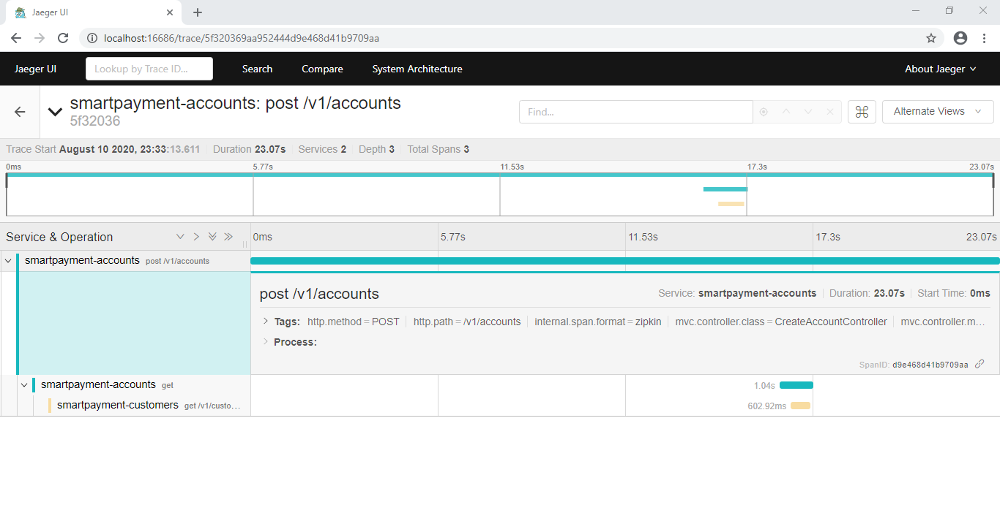

# Example Implementation of a Hexagonal Architecture

This project is an example implementation of a hexagonal architecture using the following technologies:

- JDK 11
- Maven
- MongoDB
- Spring Boot
- Spring Cloud Sleuth
- Jaeger

### How to Run

First of all run [SmartPayment Customers](https://github.com/gabrielsmartins/smartpayment-customers)

1. Build Project

`
./gradlew clean build
`

2. Run container services

`
docker-compose up --build
`

3. Send a request 

`
curl -d '{ "customer_id": "<customer_id>", "type" : "FREE", "balance" : 2500.50 }' -H "Content-Type: application/json" -X POST localhost:8080/v1/accounts
`

4. Open the Jaeger Console: http://localhost:16686/

### Run with local profile

1 . Run Jaeger Container

`
docker run -d --name jaegerserver -e COLLECTOR_ZIPKIN_HTTP_PORT=9411 -p 5775:5775/udp -p 6831:6831/udp -p 6832:6832/udp -p 5778:5778 -p 16686:16686 -p 14268:14268 -p 9411:9411 jaegertracing/all-in-one:1.8
`

`
./gradlew bootRun -Plocal
`

### Other Projects

* [SmartPayment Customers](https://github.com/gabrielsmartins/smartpayment-customers)
* [SmartPayment Orders](https://github.com/gabrielsmartins/smartpayment-orders)
* [SmartPayment Payments](https://github.com/gabrielsmartins/smartpayment-payments)
* [SmartPayment Account](https://github.com/gabrielsmartins/smartpayment-account)
* [SmartPayment Credit Card](https://github.com/gabrielsmartins/smartpayment-credit-card)

### References

[Spring Cloud Sleuth Using Zipkin and Jaeger](https://github.com/anoophp777/spring-webflux-jaegar-log4j2)

### Demonstration

#### Using Jaeger

